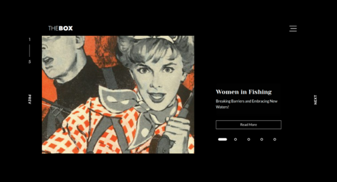
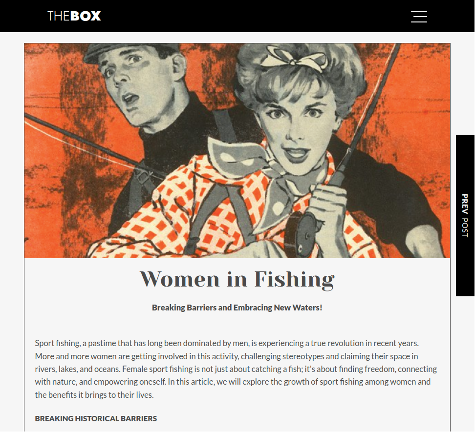

<table>
  <!-- <tr>
    <th colspan="3">
      
    </th>
  </tr> -->
  <tr>
    <td width="66%">
      
    </td>
    <td width="34%">
      
    </td>
  </tr>
</table>

<h1 className='post_title'>Sobre esse blog</h1>

Este blog em React adota a abordagem headless, na qual a camada de gerenciamento de conteúdo é separada da camada de apresentação. Diferentemente dos CMS tradicionais, como o WordPress, essa separação permite que o conteúdo seja consumido por diferentes interfaces e dispositivos de forma mais flexível. Dos CMS headless disponíveis optei por usar o Sanity pela facilidade de instalação e configuração

Essa experiência de configurar e integrar o Sanity com o React foi uma valiosa oportunidade de aprendizado e prática, permitindo que eu explorasse as capacidades do CMS headless e entendesse como ele pode ser utilizado para criar aplicações web mais dinâmicas e personalizáveis.

<h3>Dependências</h3>
<ul className='dependencias_lista'>
  <li>O <strong>ReactPlayer</strong>, usado na seção de vídeos, é uma biblioteca popular e poderosa para reprodução de mídia em aplicações React. Ela oferece uma maneira fácil de incorporar e controlar diferentes tipos de mídia, como vídeos e áudios, em componentes React.</li>
  <li>Para a criação do Carrossel de imagens na página Home usei o <strong>Slick Carousel</strong> devido a sua facilidade de uso, configuração e API intuitiva. </li>
  <li>Para adicionar o monitoramento do <strong>Google Analytics</strong> ao blog, utilizei a biblioteca <strong>React-GA4</strong>. Essa biblioteca simplifica o processo de configuração e rastreamento de eventos e métricas no Google Analytics para aplicativos React. </li>
</ul>

